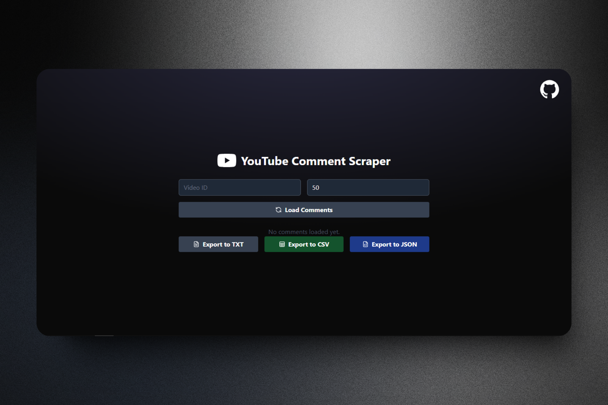
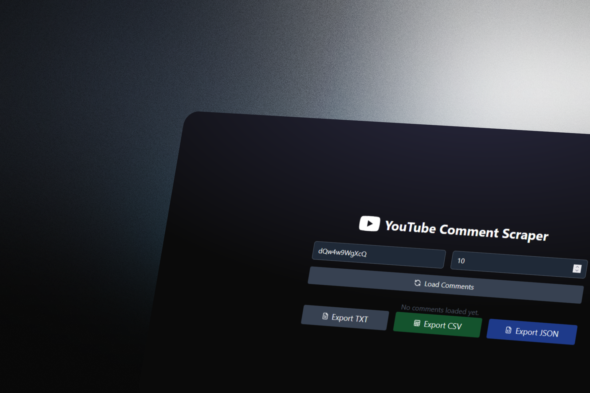
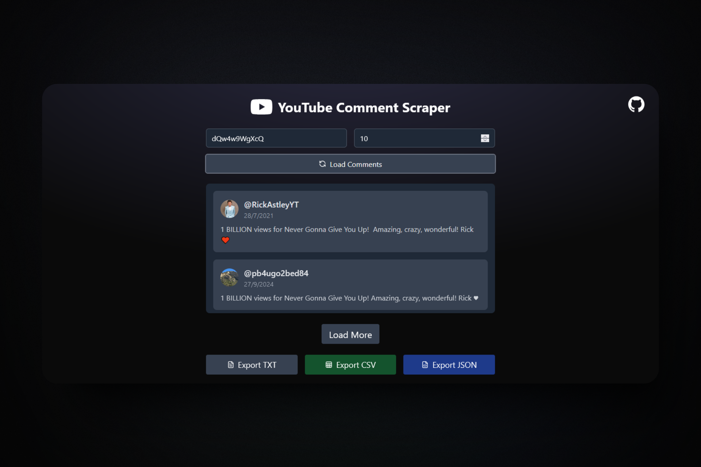

# YouTube Comment Scraper

Welcome to **YouTube Comment Scraper**, your sleek and intuitive tool for extracting and managing YouTube comments! 📝

[](https://opensource.org/licenses/MIT)
[](https://developers.google.com/youtube/v3)
[](https://reactjs.org/)
[](https://tailwindcss.com/)

## Overview

**YouTube Comment Scraper** is a cutting-edge web application designed to make scraping and exporting comments from YouTube videos seamless and efficient. With a modern UI, multiple export options, and real-time loading, this tool is perfect for content analysis, sentiment analysis, or just gathering insights from YouTube's vast audience.

## Key Features

- **Effortless Comment Extraction**: Scrape comments quickly and efficiently using the YouTube Data API.
- **Export Options**: Export scraped comments in **TXT**, **CSV**, or **JSON** formats to suit your needs.
- **Beautiful UI**: A minimalist and responsive design ensures an intuitive user experience.
- **Real-time Pagination**: Load comments progressively for large datasets without overwhelming the system.
- **Easy to Use**: Enter a YouTube video ID, set your preferences, and scrape away!

> [!TIP]  
> For optimal performance, ensure you use a valid YouTube video ID.

## Technologies Used

This project is powered by:

- **React**: Framework used for building the dynamic user interface.
- **Tailwind CSS**: Utility-first CSS framework for responsive, sleek layouts.
- **YouTube Data API v3**: Fetches comments directly from YouTube.
- **Vite**: Lightning-fast project bundler and setup tool.
- **Lucide React Icons**: Clean, customizable icon library for modern interfaces.

## Screenshots





## Installation

Follow these steps to run the project locally:

1. Clone the repository:
   ```bash
   git clone https://github.com/StevenTete/YouTubeCommentScraper.git
   cd YouTubeCommentScraper
   ```
2. Install dependencies:
   ```bash
   npm install
   ```
3. Set up the YouTube Data API by creating a `.env` file and adding your API key:
   ```bash
   VITE_YOUTUBE_API_KEY=your-youtube-api-key
   ```
4. Start the local development server:
   ```bash
   npm run dev
   ```
5. Open your browser and go to `http://localhost:5173`.

## Usage

1. Enter the YouTube video ID in the input field.
2. Specify the number of comments to scrape (default: 50).
3. Click on "Load Comments" to begin the process.
4. Once completed, export the comments in your preferred format: **TXT**, **CSV**, or **JSON**.

## Export Formats

- **TXT**: For simple, text-based readability.
- **CSV**: Ideal for data analysis in Excel or Google Sheets.
- **JSON**: Perfect for programmatic or API-based use.

## Feedback and Contributions

We'd love to hear your feedback! If you have suggestions, issues, or ideas for improvements, feel free to [open an issue](https://github.com/StevenTete/YouTubeCommentScrapper/issues) or submit a pull request. Your contributions are always welcome! 🎉

## License

**YouTube Comment Scrapper** is licensed under the [MIT License](https://opensource.org/licenses/MIT). Fork, modify, and share freely!

---

*YouTube Comment Scraper - Extract, Analyze, and Export with Ease.*
