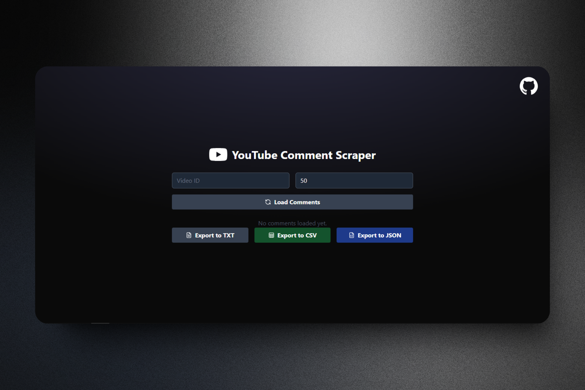

# YouTube Comment Scrapper



This project is a sophisticated web application that allows the extraction of comments from YouTube videos using the YouTube Data API. It features a sleek, modern UI designed with a minimalist approach, offering a seamless experience for scraping and viewing comments. Additionally, it provides the ability to export data in multiple formats: **TXT**, **CSV**, and **JSON**.

## Key Features

- **Comment Extraction**: Efficiently scrape comments from YouTube videos using the YouTube Data API.
- **Advanced User Interface**: Clean, intuitive, and aesthetically pleasing design for an optimal user experience.
- **Multiple Export Formats**: Export comments in **TXT**, **CSV**, or **JSON** formats for easy analysis or further usage.
- **Efficient Pagination**: Progressive loading of comments with support to fetch more data if available.
- **User-Friendly**: Fetch comments by simply entering the YouTube video ID.

## Technologies Used

This project is built using the following technologies:

- **React**: Framework used for building the user interface.
- **Tailwind CSS**: CSS framework for responsive and styled layouts.
- **YouTube Data API v3**: Google API for fetching comments from YouTube videos.
- **Vite**: Tool used for project setup and optimization.
- **Remix Icon**: Icon package used in the user interface.
- **Lucide React Icons**: Flexible and highly customizable icon library for React.

## Installation and Setup

To run this project locally, follow these steps:

1. Clone the repository to your local machine:
   ```bash
   git clone https://github.com/StevenTete/YouTubeCommentScrapper.git
   cd YouTubeCommentScrapper
   ```
2. Install the required dependencies:
   ```node
   npm install
   ```
3. Create a `.env` file in the root directory and add your YouTube Data API key:
   ```env
    VITE_YOUTUBE_API_KEY=your-youtube-api-key
   ```
4. Start the development server:
   ```node
    npm run dev
    ```
5. Open your browser and navigate to `http://localhost:5173` to view the application.


## How to Use the App

- Enter the YouTube video ID in the input field.
- Set the number of comments you want to scrape (default is 50).
- Click on "Load Comments" to start the scraping process.
- Once the extraction is complete, the comments will be available for export in **TXT**, **CSV**, or **JSON**.

## Screenshot


## Exporting Comments

The application allows you to export comments in the following formats:

- **TXT**: Comments are saved as a simple text file, ideal for basic readability.
- **CSV**: Comments are exported in a tabular format suitable for analysis in tools like Excel or Google Sheets.
- **JSON**: The JSON format is perfect for automated processing or use in applications.

## Contributing

Contributions to this project are welcome! If you'd like to contribute, feel free to submit issues or pull requests to the official repository. Suggestions, improvements, and bug fixes are greatly appreciated. 🎉

## License

This project is licensed under the **MIT License**. See the `LICENSE` file for more details.